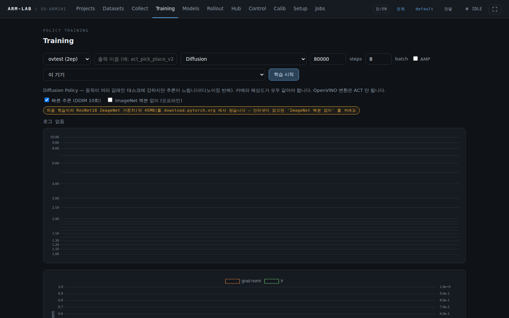

# arm-lab — SO-ARM101 / OMX 로봇팔 웹 툴

HuggingFace [lerobot](https://github.com/huggingface/lerobot) 으로 로봇팔을 **셋업 → 수집 → 학습 → 추론** 하는 과정을
명령어 없이 웹 화면에서 하는 도구입니다. (lerobot 자체가 아니라 그 위에서 도는 운용 도구입니다)


## 지원 기종

| 기종 | 모터 | 한팔 | 양팔 | 캘리브레이션 |
|---|---|---|---|---|
| **SO-ARM101** (SO-101) | Feetech STS3215 | ✅ | ✅ | 관절을 손으로 끝까지 움직여 기록 |
| **OMX** (ROBOTIS OMX-F / OMX-L) | Dynamixel XL430 / XL330 | ✅ | ✅ | 공장값 쓰기 (버튼 하나) |

기종과 한팔/양팔은 **Setup** 이나 **셋업 마법사** 맨 위에서 고릅니다. 작업대가 여러 개면 **환경**으로 나눠 저장해 두고 전환합니다.

## 설치

### 새 기기

```bash
mkdir -p ~/project && cd ~/project
git clone https://github.com/themakerrobot/arm-lab.git arm-lab
cd arm-lab
chmod +x lerobot_conda.sh
sudo -v
nohup ./lerobot_conda.sh > /dev/null 2>&1 &
sleep 3; tail -f lerobot_conda.log # 끝날 때까지 지켜보기 (로그 파일이 생길 때까지 잠깐 기다림)
```

conda 환경, PyTorch, lerobot, OMX 용 Dynamixel 패키지와 양팔 OMX 플러그인까지 설치합니다. 기기 종류는 자동으로 고릅니다.

**여러 사람이 쓰는 PC 에서도 다른 사람 환경을 바꾸지 않습니다.**
- conda(miniforge)는 `~/miniforge3` 에 **설치만** 합니다. `conda init` 을 하지 않아 `~/.bashrc` 가 그대로이고, 터미널을 열어도 conda 가 켜지지 않습니다.
  `~/.condarc` 도 쓰지 않습니다.
- torch·lerobot·openvino 등 파이썬 패키지는 전부 conda 환경 `arm-lab` 안에만 들어갑니다. 시스템 python·pip 는 그대로입니다.
- 쓸 때만 `source ~/project/arm-lab/activate.sh` 로 그 터미널에서 켭니다. 데이터·HF 캐시·torch 캐시도 레포 `data/` 안에 둡니다.
- 시스템에 하는 일: apt 기본 도구 몇 개(git, curl, build-essential, pkg-config, libgl1, libglib2.0, v4l-utils),
  시리얼 보드 udev 권한 규칙, 설치한 계정을 `dialout`·`video`(Intel 은 `render`) 그룹에 추가 — 그룹 반영은 **재로그인 후**.
- 지우기: `rm -rf ~/project/arm-lab ~/miniforge3` (다른 conda 를 이미 쓰고 있었다면 `~/miniforge3` 는 이 스크립트가 만든 것인지 확인 후)

Ubuntu 22.04 / 24.04 / 26.04 를 대상으로 합니다. 파이썬은 conda 안의 3.12 를 쓰므로 우분투 기본 파이썬 버전과 무관합니다.
우분투 버전마다 이름이 바뀐 apt 패키지는 대체 이름으로 다시 시도하고, 그래도 없으면 경고만 남기고 계속합니다.

| 플랫폼 | 고르는 조건 | PyTorch | 추론 |
|---|---|---|---|
| `thor` | aarch64 (Jetson Thor) | CUDA 13 휠 | PyTorch (GPU) |
| `cuda` | x86_64 + NVIDIA GPU | CUDA 13 휠 | PyTorch (GPU) |
| `intel` | x86_64 + NVIDIA 없음 (Core Ultra 권장) | CPU 휠 + **OpenVINO / NNCF** | OpenVINO **NPU / GPU / CPU** |

자동 판정이 틀리면 `ARMLAB_PLATFORM=intel ./lerobot_conda.sh` 처럼 지정합니다.
Intel 기기에서 내장 Arc GPU 로 학습까지 해 보려면 `ARMLAB_PLATFORM=intel ARMLAB_TORCH=xpu ./lerobot_conda.sh` (**실험적**, 아래 참고).
Intel 쪽은 아래
[Intel Core Ultra 에서 추론](#intel-core-ultra-에서-추론--openvino) 을 보세요.

### 이미 설치된 기기 업데이트

```bash
cd ~/project/arm-lab && git pull
source activate.sh
# OMX 를 처음 쓸 때 한 번만
pip install "dynamixel-sdk>=3.7.31,<3.9.0"
pip install --no-deps -e plugins/lerobot_robot_bi_omx -e plugins/lerobot_teleoperator_bi_omx
# Training 에서 Diffusion / SmolVLA 를 처음 쓸 때 한 번만
(cd lerobot-src && pip install -e ".[diffusion,smolvla]")
# Intel 기기에서 OpenVINO 를 처음 쓸 때 한 번만
pip install "openvino>=2025.4" "nncf>=2.19"
```

### 예전 설치(lrweb, `~/project/lerobot`)에서 옮기기

arm-lab 으로 이름이 바뀌면서 실행 파일(`lrweb.py` → `main.py`), 작업 폴더, 설정 파일 이름(`lrweb_*` → `armlab_*`), conda 환경 이름
(`lerobot` → `arm-lab`)이 바뀌었습니다. 새로 설치한 뒤 예전 기기의 데이터·설정을 이렇게 옮깁니다.

```bash
OLD=~/project/lerobot; NEW=~/project/arm-lab
cp -a $OLD/data $NEW/                     # 데이터셋 + 캘리브레이션 (data/hf/lerobot/...)
cp -a $OLD/outputs $NEW/                  # 학습한 모델
cd $OLD && for f in lrweb_*.json; do cp "$f" "$NEW/armlab_${f#lrweb_}"; done   # 설정·프로젝트·환경 목록
[ -d lrweb_envs ] && cp -a lrweb_envs $NEW/armlab_envs
```

- 설정(`armlab_config.json`)을 옮기면 Setup·캘리브레이션을 다시 할 필요가 없습니다
- 새로 설치하지 않고 예전 폴더에서 `git pull` 만 했다면, conda 환경 이름이 달라 `activate.sh` 가 실패합니다 —
  `conda rename -n lerobot arm-lab` 로 이름을 바꾸거나 새로 설치하세요

## 실행

```bash
source ~/project/arm-lab/activate.sh      # conda 활성화 + 작업 폴더로 이동
nohup python main.py > arm-lab.log 2>&1 &
```

브라우저에서 `http://<기기 IP>:8080/` 으로 들어갑니다. 업데이트했으면 **arm-lab 을 껐다 켜고** 브라우저는 강력 새로고침(Ctrl+Shift+R) 하세요.

### 화면 언어 — 한/EN

위쪽 막대의 **한/EN** 버튼을 누르면 한국어 ↔ 영어가 바뀌고 보던 화면으로 돌아옵니다. 브라우저마다 기억합니다(쿠키).
처음부터 영어로 열리게 하려면 `ARMLAB_LANG=en python main.py` 로 실행하세요.

- 직접 입력한 글(태스크 설명, 설정값, 메모)은 번역하지 않고 그대로 둡니다 — 영어 화면에서 저장해도 바뀌지 않습니다.
- 번역은 `armlab_i18n_en.json` 사전 하나로 합니다. 고치면 재시작 없이 다음 새로고침부터 반영됩니다.
  사전에 없는 문장은 한국어로 남습니다. lerobot 이 내보내는 로그는 원문(영어) 그대로입니다.


## 처음 셋업 — 셋업 마법사

**Setup → 셋업 마법사**. 맨 위에서 기종과 한팔/양팔을 고르고, 팔 칸(양팔이면 4개)을 하나씩 누르면 안 끝난 단계부터 이어집니다.
모터를 구동하는 단계는 없습니다 — 전부 손으로 움직여서 확인합니다.

1. **포트 찾기** — 감시를 켜고 그 팔만 손으로 움직이면, 움직인 포트가 초록으로 추천됩니다. ⚠️ 감시 중엔 토크가 꺼지니 팔로워를 받치세요
2. **진단** — 모터 응답·전압·온도·보호 플래그. 정상이면 한 줄 요약만 나옵니다. 모터가 안 보이면 그 자리에서 **모터 ID 세팅**
   (새 모터를 한 개씩 꽂고 안내대로 `ID 쓰기`)
3. **캘리브레이션**
   - SO-ARM101: 관절마다 기계적 한계 양 끝까지 천천히 움직입니다. 3D 모터가 모두 초록이 되면 저장.
     `wrist_roll` 은 **저장하는 순간의 자세가 0°** 이니 그리퍼를 똑바로 두고 저장하세요.
     다른 PC 에서 캘리브레이션한 팔이면 **보드에서 가져오기** 로 건너뜁니다
   - OMX: **공장값 쓰기** 버튼 하나 (lerobot 이 OMX 를 공장값으로 씁니다)
4. **확인** — 손으로 팔을 움직였을 때 3D 가 실물과 같은 방향·같은 각도로 움직이면 **일치함 — 완료**

| 캘리브레이션 (SO-ARM101) | 확인 |
|---|---|
|  |  |

| OMX 공장값 쓰기 | OMX 확인 |
|---|---|
|  |  |

카메라는 마법사 아래 안내대로 **Setup → 3 · 카메라** 에서 스캔하면 썸네일이 찍혀서 어느 장치가 어느 카메라인지 보고 등록할 수 있습니다.

## 탭별 사용법

### Projects

태스크 하나를 묶는 단위입니다 (기본 태스크 설명, 기준 환경, 데이터셋, 모델). 프로젝트를 열면 Datasets·Collect·Training·Models·Rollout 이
그 프로젝트 기준으로 보이고, 새 데이터셋·모델이 자동으로 들어갑니다. '전체' 를 고르면 모두 보입니다. 없어도 다른 기능은 그대로 됩니다.


### Setup


| 칸 | 하는 일 |
|---|---|
| 0 · 환경 | 하드웨어 구성 한 벌(기종·모드·포트·캘리브 id·카메라)을 이름 붙여 저장·전환 |
| 1 · 기종 · 모드 | SO-ARM101 / OMX, 한팔 / 양팔. 팔별 포트·캘리브 id·3D 배치 |
| 2 · USB 시리얼 포트 | 포트 스캔, probe(모터 ID 확인), **포트 감시**로 리더/팔로워 판별 |
| 2b · 모터 ID 세팅 | 새 팔 조립 때 — 모터를 한 개씩 꽂고 ID 쓰기 (OMX 는 팔로워/리더를 골라서) |
| 2c · 팔 불량 점검 | 모터 응답·보호 플래그·전원·엔코더 점검 (서보에 쓰지 않음) |
| 3 · 카메라 | 스캔(썸네일), 팔 카메라·공용 카메라 등록, 해상도·fps·**형식**(자동 / MJPG / YUYV) — USB 카메라 여러 대가 한 허브에서 끊기면 MJPG |
| 4 · 기타 | fps, `max_relative_target`(한 스텝 이동 제한), 기본 태스크 |

값을 바꾸면 **설정 저장**을 눌러야 적용됩니다 (기종·모드 버튼은 바로 적용).

### Calib

캘리브레이션만 따로 할 때 씁니다 (마법사와 같은 동작). SO-ARM101 은 범위 기록, OMX 는 공장값 쓰기입니다.
⚠️ 시작하면 토크가 꺼집니다 — 팔로워는 받치세요.

### Control

팔로워 수동 제어. 탭에 들어오면 자동으로 연결되고, 떠나면 토크를 끄고 연결을 끊습니다.

- **토크 ON** 후 슬라이더로 관절 이동 (속도 제한), **리더 팔로우** 로 리더를 따라가게
- **E-STOP** — 즉시 모든 팔 토크 해제
- 카메라 화면과 3D 가 함께 나옵니다. 명령을 못 따라가는 관절(막힘·보호)과 과열은 빨갛게 표시됩니다
- 단위: SO-ARM101 은 °, OMX 는 -100~100 (그리퍼는 둘 다 0~100)


### Collect

수집 설정(데이터셋 이름·태스크·에피소드 수·최대 길이)을 넣고 시작합니다. **자동으로 녹화되지 않습니다.**

```
대기(리더 따라가기만) ──[s 녹화 시작]──▶ 녹화 ──[n 저장하고 다음]──▶ 대기
                                          └───[r 버리고 다시]──▶ 대기
```

| 키 | 버튼 | 언제 |
|---|---|---|
| `Space` · `→` · `s` | 녹화 시작 | 대기 중 |
| `Space` · `→` · `n` | 저장하고 다음 | 녹화 중 |
| `←` · `Backspace` · `r` | 버리고 다시 | 녹화 중 |
| `Esc` | 수집 끝내기 | 대기 중 (녹화 중이던 에피소드는 버림) |

- **신호음**: 녹화 시작(높아지는 음), 저장(낮아지는 음), 최대 길이 마지막 3초(삑 3번). 화면을 안 보고 팔을 움직일 때 편합니다.
  오른쪽 위 **소리 켜짐/꺼짐** 으로 끕니다

- 목표 에피소드 수는 진행률 표시용입니다. 다 채워도 멈추지 않으니 **수집 끝내기**로 마칩니다
- 최대 길이가 지나면 자동 저장됩니다
- 대기 중에는 모터 온도가 보입니다. 응답이 없으면 오른쪽 위 **강제 종료** (녹화 중이던 데이터는 사라지고 토크가 남을 수 있음).
  강제 종료·정전으로 끊긴 데이터셋은 Datasets 에 **마무리 안 됨** 으로 표시되고 **복구** 로 살릴 수 있습니다
- 기존 데이터셋에 **이어서 수집**도 됩니다 (같은 기종·모드로 찍은 것만)

| 수집 설정 | 수집 진행 |
|---|---|
|  |  |

### Datasets / 리뷰

목록에서 데이터셋 이름을 누르면 리뷰 화면이 열립니다.

- 카메라 전부를 한 시계로 맞춘 재생, 3D 재생, 관절 그래프 (클릭하면 그 시점으로)
- 단축키: ← / → 에피소드 이동, Space 재생/정지, **, / .** 한 프레임 앞뒤, X 불량 표시. 재생 속도 0.25× ~ 2×
- 불량 표시한 에피소드 일괄 삭제, 이름 변경, **v3.0 형식으로 다운로드**(tar), 에피소드 추가(이어서 수집)
- **짧음** 배지 = 길이가 중앙값의 절반도 안 되는 에피소드
- 목록 아래 **데이터셋 가져오기** — 다운로드한 tar(또는 LeRobot 데이터셋 폴더를 묶은 tar/zip)를 다른 기기에 그대로 넣습니다
- **마무리 안 됨** 배지 = 녹화가 끊겨 열리지 않는 데이터셋. **복구** 를 누르면 남은 온전한 에피소드로 색인을 다시 만듭니다
  (고치기 전에 meta·data 를 `.repair_backup/` 에 백업, 끊긴 마지막 에피소드는 잃을 수 있음)

| 목록 | 리뷰 |
|---|---|
|  |  |

### Training

데이터셋과 **정책**을 골라 학습을 시작합니다. 학습 중에도 Control 은 쓸 수 있습니다.

| 정책 | 언제 | 어디서 학습 | 참고 |
|---|---|---|---|
| **ACT** (기본) | 데모 50개 안팎, 가볍고 빠름 | 이 기기 (CPU·GPU) | OpenVINO(NPU) 변환 가능 |
| **Diffusion** | 동작이 여러 갈래인 태스크 | 이 기기 (GPU 권장) | 카메라 해상도가 모두 같아야 함. 추론이 느림 → **빠른 추론 (DDIM 10회)** 기본 켜짐 |
| **SmolVLA** | 태스크 설명(언어)을 쓰는 450M 사전학습 모델 미세조정 | GPU | 처음 한 번 인터넷으로 내려받음 |
| **X-VLA** | 0.9B 사전학습 모델(`lerobot/xvla-base`, 3.5GB) 미세조정, 언어 사용 | **CUDA GPU** (Thor·HF Jobs) | 카메라 최대 3대 — 전경 카메라부터 모델 시점 1·2·3 에 자동 연결 |
| **MolmoAct2** | Ai2 의 SO-100/101 사전학습 가중치(21.8GB)에서 동작 전문가만 미세조정, 언어 사용 | **CUDA GPU 18 GiB 이상** (Thor·HF Jobs) | **SO-ARM101 한팔 전용**, 카메라 2대(전경·손목) 권장. 이어서 학습 불가 (lerobot 버그) |

- 정책을 바꾸면 그 정책에 맞는 기본 step 수가 들어가고, 데이터셋·정책 조합을 **시작 전에 점검**합니다
  (예: Diffusion 인데 카메라 해상도가 다름, MolmoAct2 인데 양팔·OMX 데이터, 이 기기에 CUDA GPU 없음 → 빨간 표시로 막음)
- **ImageNet 백본 없이 (오프라인)** — ACT·Diffusion 은 처음 학습할 때 ResNet18 가중치(약 45MB)를 인터넷에서 받습니다.
  인터넷이 없는 기기면 이걸 켜세요 (데이터가 적으면 성능이 조금 떨어질 수 있음). 받아 둔 적이 없으면 화면에 노란 안내가 뜹니다
- loss 그래프 + **grad norm·학습률** 그래프, **진행률·남은 시간**이 실시간으로 보입니다
- **AMP** 를 켜면 CUDA 에서 메모리·시간을 아낍니다 (손실이 튀면 끄세요)
- 정책에 필요한 패키지가 없으면 목록에 "패키지 미설치" 로 나오고 **필요한 패키지 설치** 버튼이 생깁니다
  (torch 는 지금 버전으로 고정한 채 설치 — CUDA 휠이 바뀌지 않음)
- **실행 위치** 에서 **HF Jobs** GPU 를 고르면 Hugging Face 클라우드에서 학습합니다 (시간당 요금이 목록에 보임, Hub 로그인 필요).
  이 기기 GPU 를 쓰지 않으므로 그동안 수집·추론을 계속할 수 있습니다. X-VLA·MolmoAct2 처럼 큰 모델은 이쪽을 권합니다. 자세한 건 [Hub](#hub) 참고
- X-VLA·MolmoAct2 는 **lerobot 문서 기준 수치**이고, Thor(aarch64)에서의 동작은 아직 실측하지 못했습니다



화면 아래 **OpenVINO 변환** 은 Intel 기기용입니다 — [Intel Core Ultra 에서 추론](#intel-core-ultra-에서-추론--openvino) 참고.

### Models

학습한 모델(출력 폴더) 하나가 카드 하나입니다.

- 정책 · 데이터셋 · 진행 step · 마지막 loss · 학습 시간
- 체크포인트별 **OpenVINO 변환 상태**와 **실기 성공률** (Rollout 에서 기록한 성공/실패)
- **롤아웃** (그 체크포인트를 골라 Rollout 으로), **내보내기**(tar), 삭제
- **이어서 학습** — 중단했거나 더 돌리고 싶은 학습을 마지막 체크포인트에서 목표 step 까지 이어서 돌립니다
- 맨 위 **모델 가져오기** — 다른 기기에서 내보낸 tar 를 넣으면 같은 폴더 구조로 들어옵니다 (OpenVINO 변환본 포함)


### Rollout

학습된 체크포인트를 골라 자율 구동합니다. 지금 기종·모드와 다른 데이터로 학습한 체크포인트는 막힙니다.
`max_relative_target` 을 설정해 두면 정책 출력이 튀어도 한 스텝 이동량이 제한됩니다.


**추론 엔진** 에서 PyTorch(기본) 또는 OpenVINO NPU / GPU / CPU 를 고릅니다. OpenVINO 는 Intel 기기에서
체크포인트를 먼저 변환해 둬야 보입니다. 중지하면 어느 엔진이든 시작 자세로 돌아간 뒤 토크를 끕니다.

시작하면 **실시간 화면**으로 바뀝니다.

- 카메라와 3D 팔, 관절별 **실측 / 명령 / 차이** (차이가 크게 유지되면 노란색 — 막힘·과부하·학습 범위 밖)
- **제어 주기(Hz)** 와 **추론 시간** (청크 계산 · 보통 틱) — 프레임 예산을 넘으면 경고
- **성공 (S) / 실패 (F)** 버튼 — 물체를 놓고 한 번 시도할 때마다 누릅니다. 체크포인트별 실기 성공률이 쌓여
  Models 탭·체크포인트 목록에 나옵니다 (U 로 마지막 기록 취소)
- 끝난 실행도 아래 **최근 실행** 에서 다시 열어 결과를 기록할 수 있습니다
- 체크포인트를 고르면 **사전 점검**을 합니다 — 정책이 쓰는 카메라 이름·해상도, 관절 수(한팔/양팔)를 지금 Setup 과 대조해
  안 맞으면 팔이 움직이기 전에 막습니다(해상도 차이는 경고). 언어 지시를 쓰는 정책(SmolVLA 등)은 태스크 설명이 필요합니다
- 실패하면 로그에서 원인을 추정해 **원인 추정** 으로 보여 줍니다 (모터 무응답·과부하·포트·카메라·캘리브레이션 등)
- 모터 값이 캘리브레이션 파일과 다르면 파일 값을 모터에 쓰고 진행합니다 (Control 탭 연결과 같은 동작).
  캘리브레이션 파일이 아예 없으면 멈추고 Calib 탭으로 안내합니다


#### 큰 사전학습 모델로 롤아웃 (X-VLA · MolmoAct2)

- 이 정책들은 카메라 이름이 모델 쪽에 정해져 있습니다 (X-VLA `image·image2·image3`, MolmoAct2 SO-101 `cam0·cam1`).
  arm-lab 이 학습 때 쓴 연결을 체크포인트에서 읽어 그대로 쓰고, 없으면 **전경 카메라 → 손목 카메라** 순으로 연결합니다.
  연결 내용은 시작 전 점검에 노란 표시로 나옵니다 (예: `카메라 연결: top → cam0, wrist → cam1`)
- **학습 없이 MolmoAct2 시연**: Hub 탭에서 모델 `lerobot/MolmoAct2-SO100_101-LeRobot` 을 받은 뒤 Rollout 에서 고르면 됩니다.
  SO-ARM101 한팔·카메라 2대·CUDA GPU(추론 약 12 GiB) 필요. 처음 실행 때 원본 가중치 `allenai/MolmoAct2-SO100_101`(21.8GB)도 함께 내려받으므로
  **디스크 50GB 이상**을 비워 두세요
- GPU 가 없는 기기에서 이런 정책이나 Diffusion(디노이징 많음)을 고르면 "매우 느릴 수 있음" 경고가 뜹니다

### Hub

Hugging Face Hub 와 주고받습니다.

- **로그인** — [토큰](https://huggingface.co/settings/tokens)(write 권한)을 붙여 넣습니다. 터미널의 `hf auth login` 과 같은 곳에 저장됩니다
- **데이터셋 올리기** — 내 계정 `사용자/데이터셋이름` 으로 (기본 비공개)
- **받기** — repo id 로 **데이터셋**(커뮤니티 데이터셋으로 학습) 또는 **모델**(다른 곳에서 학습한 정책을 이 팔로 실행)을 받습니다.
  받은 것은 Datasets / Models 탭에 나옵니다. 데이터셋은 LeRobot v3.0 형식이어야 합니다
- **클라우드 학습 (HF Jobs)** — Training 탭 **실행 위치** 에서 GPU 를 고르면:
  1. 로컬 데이터셋을 내 계정 **비공개** repo 로 올리고 (이어서 수집한 에피소드까지 매번 갱신)
  2. lerobot 의 원격 학습(`--job.target`)으로 제출, 체크포인트는 매번 Hub 모델 repo 로 올라갑니다
  3. 학습 로그·그래프는 Training 탭에 그대로 보이고, 끝나면 Hub 탭의 **모델 받기** → Models / Rollout
  - **유료**입니다 (목록의 $/h). 중지하면 원격 작업도 취소합니다 — Hub 탭의 **원격 취소** 로도 됩니다


### Jobs

수집·학습·추론 같은 백그라운드 작업 목록과 로그. 여기서 중지할 수 있습니다.

## Intel Core Ultra 에서 추론 — OpenVINO

Ubuntu Intel Core Ultra 노트북·미니PC 에서 셋업·캘리브레이션·Control·수집·리뷰는 Thor 와 똑같이 되고,
추론은 OpenVINO 로 **NPU** 에서 돌립니다. 학습은 아래 [Intel 기기에서 학습](#intel-기기에서-학습) 중 하나를 고르세요.
**Meteor Lake (Core Ultra 1세대) 이상**을 기준으로 합니다. 지금은 **ACT** 정책만 지원합니다.

**1. 설치** — Intel 기기에서 위 [설치](#설치) 그대로 실행하면 `intel` 플랫폼으로 잡혀 OpenVINO 까지 설치됩니다.
스크립트는 NPU·GPU 드라이버를 **설치하지 않고 점검만** 합니다. 로그에 경고가 나오면 직접 설치하세요.

- NPU: `/dev/accel/accel0` 이 있어야 합니다. 커널 `intel_vpu` 드라이버 + [linux-npu-driver](https://github.com/intel/linux-npu-driver/releases)
  (Ubuntu·커널 버전 조합은 릴리스 노트로 확인 필요)
- GPU(내장 Arc): [compute-runtime](https://github.com/intel/compute-runtime/releases) (`intel-opencl-icd`, level-zero)
- 설치 후 `render` 그룹 반영을 위해 재로그인

**2. 모델 가져오기** — 학습 기기의 **Models** 탭에서 체크포인트를 **내보내기** 하고, Intel 기기의 **Models → 모델 가져오기** 로 넣습니다.
학습에 쓴 데이터셋도 **Datasets** 에서 다운로드 → 가져오기 하면 실제 프레임으로 검증하고 INT8 도 만들 수 있습니다.
(폴더를 직접 복사해도 됩니다: `outputs/<이름>/`, `data/hf/lerobot/local/<이름>/`)

**3. 변환** — **Training** 탭 아래 **OpenVINO 변환** 에서 체크포인트를 고르고 변환합니다 (수십 초).
이 기기의 장치마다 PyTorch 결과와의 **최대 오차(관절 단위)** 와 **추론 시간(평균·p95)** 을 재서 표로 보여 줍니다.
p95 가 프레임 예산(30 fps 면 33 ms) 안이고 오차가 작으면 **OK** 입니다.


**4. 추론** — **Rollout** 탭에서 추론 엔진 **OpenVINO · NPU** 를 고르고 시작합니다.


(위 캡처는 NPU 없는 시험 서버라 CPU 행만 보입니다. Core Ultra 에서는 NPU · GPU 행이 함께 나옵니다.)
실행 중 화면에서 엔진 배지(예: `OpenVINO · NPU · fp16`)와 실제 추론 시간을 확인할 수 있습니다.

알아 둘 것
- 고른 장치를 못 쓰면 **NPU → GPU → CPU** 순으로 대신 실행하고, 작업 로그에 `요청한 NPU 대신 CPU 로 실행합니다` 라고 크게 남깁니다.
- 카메라 해상도는 **학습 데이터 기준으로 고정**됩니다 (NPU 는 고정 크기만 받습니다). Setup 의 카메라 이름·해상도가 다르면
  팔이 움직이기 전에 시작이 거부됩니다.
- 체크포인트를 다시 학습·덮어쓰면 **OV(다시 변환 필요)** 로 표시되고 시작이 막힙니다 — 다시 변환하세요.
- 추론 중 로그에 `[ov] 추론 … ms` 가 주기적으로 찍힙니다. 프레임 예산을 넘으면 청크가 바뀌는 순간 한 박자 멈출 수 있습니다.
- INT8 은 더 빠를 수 있지만 오차가 커집니다. 표의 오차·판정을 보고 고르세요. 기본은 FP16 입니다.

### Intel 기기에서 학습

Training 탭은 이 기기의 학습 장치를 표시합니다 (`GPU: …` / `Intel GPU(XPU) … — 실험적` / `CPU 로 학습 — 매우 느립니다`).

| 방법 | 어떻게 | 비고 |
|---|---|---|
| **HF Jobs (권장)** | Training 탭 **실행 위치** 에서 HF Jobs GPU 선택 | 기기와 무관. 유료(시간당), Hub 로그인 필요. 끝나면 Hub 탭에서 모델 받기 → OpenVINO 변환 |
| **NVIDIA 기기** | Thor 등에서 학습 → Models 내보내기 → Intel 기기에서 가져오기 | 위 2단계 |
| **이 기기 Intel GPU (실험적)** | 설치 때 `ARMLAB_TORCH=xpu` → 실행 위치 '이 기기' | PyTorch XPU 휠 + lerobot 자동 장치 선택. **실기 검증 전** — ACT 기준 |
| 이 기기 CPU | 기본 설치 그대로 '이 기기' | 매우 느림. 동작 확인용 |

XPU 경로 알아 둘 것
- 설치 스크립트가 XPU 휠을 못 받으면 CPU 휠로 내려가 계속 설치하고 로그에 경고를 남깁니다. 끝에 `torch 휠: xpu` 로 나와야 합니다.
- Intel GPU 컴퓨트 런타임(위 GPU 항목의 compute-runtime / level-zero)이 있어야 `xpu: True` 로 잡힙니다. 설치 후 재로그인(render 그룹).
- 학습한 체크포인트는 그대로 OpenVINO 변환·NPU 추론에 쓸 수 있습니다 (변환은 항상 CPU 에서 PyTorch 결과와 대조).
- X-VLA·MolmoAct2 는 CUDA 전용이라 XPU 로도 학습할 수 없습니다 — HF Jobs 를 쓰세요.
- XPU 에서 어떤 정책·batch 가 메모리(내장 GPU 는 시스템 RAM 공유)에 들어가는지는 **확인 필요**입니다.

## 팔 없이 시험하기 — 가상 팔

실제 팔이 없어도 셋업 마법사·Calib·Control·Collect 를 끝까지 돌려 볼 수 있습니다. arm-lab 과 **별도 터미널**에서 켭니다.

```bash
source ~/project/arm-lab/activate.sh
python tools_simarms.py --robot so101 --mode bimanual    # SO-ARM101 양팔 (보드 4개)
python tools_simarms.py --robot omx   --mode single      # OMX 한팔 (보드 2개)
```

- 켜 두는 동안 포트 목록에 **가상 …** 보드로 나타나고, 끄면(`q` 또는 Ctrl+C) 사라집니다. arm-lab 재시작은 필요 없습니다
- 모터는 실제 프로토콜(Feetech / Dynamixel)로 lerobot 과 통신합니다. 처음엔 캘리브레이션 안 된 공장 상태입니다
- 손으로 움직이는 대신 콘솔 명령을 씁니다: `w <번호>` 그 보드 관절 쓸기 (포트 찾기·캘리브레이션·확인), `a` 리더 자동 움직임 (리더 팔로우·수집), `l` 목록
- 포트 경로는 `armlab_sim/<이름>` 으로 고정이라 껐다 켜도 다시 지정할 필요가 없습니다
- Setup 기종·구성을 가상 팔과 같게 맞추세요 (환경을 하나 복사해서 쓰면 실제 팔 설정이 안 지워집니다)
- 모터 ID 세팅은 흉내내지 않습니다. Collect 는 카메라가 하나 이상 등록돼 있어야 시작됩니다
- 실제 팔을 쓸 때는 이 도구를 켜지 않으면 됩니다 — 실제 팔 동작과는 관계가 없습니다

## 팔 불량 점검 (터미널)

Setup 탭의 팔 불량 점검과 같은 판정을 터미널에서도 돌릴 수 있습니다 (arm-lab 이 그 포트를 잡고 있지 않을 때).
서보에 아무것도 쓰지 않습니다.

```bash
python tools_armcheck.py --port /dev/serial/by-id/usb-... --role follower   # SO-ARM101
python tools_dxlcheck.py --port /dev/serial/by-id/usb-... --role follower   # OMX
```

종료 코드: `0` 정상 / `1` 주의 / `2` 불량 의심 / `3` 실행 실패. `--json` 으로 기록용 출력.

## 문제 해결

| 증상 | 확인 |
|---|---|
| 포트가 안 보임 | USB 다시 꽂기, 사용자가 `dialout` 그룹인지 (`sudo usermod -aG dialout $USER` 후 재로그인) |
| "캘리브레이션 파일이 없습니다" | 셋업 마법사 ③ 또는 Calib 탭 (기종마다 파일 폴더가 따로입니다) |
| 3D 가 안 나옴 | three.js 를 인터넷(CDN)에서 받습니다. 인터넷이 없으면 3D 칸만 빠지고 나머지는 동작 |
| 데이터셋에 "모드 불일치" | 그 데이터셋을 찍은 기종·한팔/양팔과 지금 설정이 다름 — 이어받기·추론 불가 (학습은 가능) |
| "다른 작업 실행 중" | Control 탭이 열려 있거나 수집·감시·캘리브레이션이 도는 중 — Jobs 탭이나 해당 화면에서 끝내기 |
| 양팔 OMX 추론이 안 됨 | 플러그인 설치 필요 — 위 "이미 설치된 기기 업데이트" 의 두 번째 `pip` 줄 |
| 수집 화면이 멈춤 | 오른쪽 위 **강제 종료** 후 다시 시작 |
| 업데이트 후 화면이 이상함 | arm-lab 재시작 + 브라우저 강력 새로고침 |
| 데이터셋에 "마무리 안 됨" | 녹화가 끊긴 데이터셋 — Datasets 의 **복구** (백업 후 남은 에피소드로 색인 재생성) |
| 롤아웃이 바로 끝남 | 실행 화면의 **원인 추정** 과 로그 확인 (모터 무응답·과부하·포트·카메라·캘리브레이션) |
| "정책이 카메라 … 를 씁니다" / "관절 수 …" | 학습 때와 카메라 이름·한팔/양팔이 다름 — Setup 을 학습 때와 같게 |
| 카메라 여러 대가 끊김·멈춤 | Setup → 카메라 **형식** 을 MJPG 로 (USB 대역폭) |
| Hub 받기 실패 | `huggingface.co` 와 `*.xethub.hf.co`(대용량 파일) 접속 확인. 비공개 repo 는 소유자 토큰 필요 |
| HF Jobs 학습을 멈췄는데 요금이 걱정됨 | Hub 탭의 **원격 취소** — 중지 버튼도 원격 작업을 취소하지만, HF Jobs 페이지에서 상태를 한 번 확인하세요 |

### 예전 버전으로 되돌리기

SO-ARM101 만 쓰던 안정 버전에 태그가 있습니다.

```bash
git checkout so-arm101-stable    # 되돌리기 (이 버전은 실행 파일이 lrweb.py, 설정이 lrweb_config.json 입니다)
git checkout main                # 최신으로
```

## 접속 보안

기본은 인증 없이 `http://<host>:8080/` 으로 들어갑니다. 필요하면 토큰을 켭니다.

```bash
ARMLAB_TOKEN=원하는값 python main.py    # 토큰 직접 지정
ARMLAB_AUTH=on        python main.py    # armlab_token.txt 에 자동 생성
```

인증과 별개로, 다른 웹사이트가 브라우저를 통해 몰래 보내는 요청은 받지 않습니다.

## 더 보기

구조와 설계 이유, 설정 파일 형식, 판정 근거는 [docs/DEVELOPMENT.md](docs/DEVELOPMENT.md) 에 있습니다.

## License

- 코드: MIT — [LICENSE](LICENSE)
- `urdf/` SO-101 URDF·STL: [TheRobotStudio SO-ARM100](https://github.com/TheRobotStudio/SO-ARM100) (Apache 2.0) — [urdf/LICENSE.md](urdf/LICENSE.md)
- `urdf/omx_f.urdf`, `urdf/open_manipulator_description/`: [ROBOTIS open_manipulator](https://github.com/ROBOTIS-GIT/open_manipulator) (Apache 2.0) — [urdf/LICENSE-omx.md](urdf/LICENSE-omx.md)
- `plugins/`: lerobot `bi_so_follower` / `bi_so_leader` 구조를 따른 코드 (Apache 2.0)
- `tools_dsrepair.py`: [huggingface/leLab](https://github.com/huggingface/leLab) `dataset_repair.py` 를 옮겨 고친 코드 (Apache 2.0, 파일 머리에 표기)
